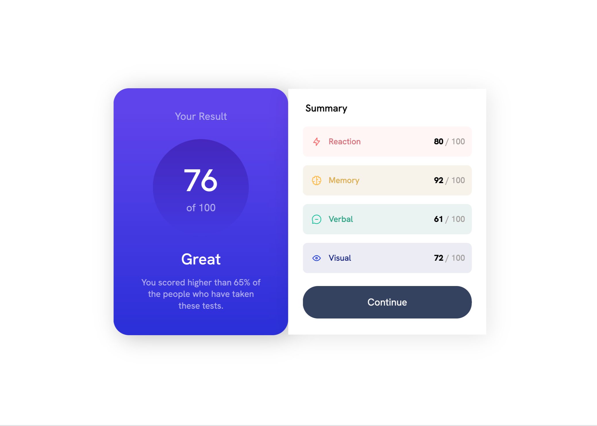

# Frontend Mentor - Results summary component solution

This is a solution to the [Results summary component challenge on Frontend Mentor](https://www.frontendmentor.io/challenges/results-summary-component-CE_K6s0maV). Frontend Mentor challenges help you improve your coding skills by building realistic projects.

## Table of contents

- [Overview](#overview)
  - [Screenshot](#screenshot)
  - [Links](#links)
- [My process](#my-process)
  - [Built with](#built-with)
  - [What I learned](#what-i-learned)

## Overview

### Screenshot

Mobile View:


Desktop View:



### Links

- Solution URL: [Link](https://github.com/jerryren527/results-summary-component-react)
- Live Site URL: [Link](https://jerryren527.github.io/results-summary-component-react/)
- Custom Figma File: [Link](https://www.figma.com/file/CoyaiGK65EDfxxG6gBsYqK/results-summary-component?node-id=0%3A1&t=ymMQQHLFnNxsrOfO-1)

### My process

### Built with

- HTML
- CSS
- Flexbox
- React

### What I learned

To set the webpage title and icon in a React app, you can modify the HTML file that is generated by your React app's build process. This file is the `index.html` and is located in the `public` folder.

Make the following changes:

```html
<head>
  <link rel="icon" href="%PUBLIC_URL%/favicon-32x32.png" />
  <title>Frontend Mentor | Results summary component</title>
</head>
```

---

The public folder in a React application is used to store static assets that are not processed by the build system. The contents of this folder are copied as-is to the root of the build folder when you run npm run build.

Some examples of files that could be included in the public folder are:

- `Favicon.ico`: The icon that appears in the browser tab or bookmark bar.

---

In `create-react-app`, relative paths for images don't seem to work. Instead, you can import an image [[Link](https://stackoverflow.com/questions/37644265/correct-path-for-img-on-react-js)]:

```js
import ReactionLogo from "../assets/images/icon-reaction.svg";

export const Summary = () => {
  return (
    <div className="summary">
      <p className="bold">Summary</p>
      <SummarySection score={80} icon={ReactionLogo} category={"Reaction"} />
    </div>
  );
};
```

```js
export const SummarySection = ({ category, icon }) => {
  return (
    <div>
      
    </div>
  );
};
```

---

The `aria-label` attribute is used to provide a label for an element that is not visible on the screen, but is still accessible to users who are using assistive technologies. The `aria-label` attribute should only be used when there is no visible label or accessible name for an element.

If you want to add an alt attribute to an image imported as a ReactComponent, you can pass it as a prop to the component, like this:

```js
<ReactionLogo alt={"Reaction logo"} />
```

- The `alt` attribute will be added to the `img` tag generated by the `ReactionLogo` component.
